# 우선순위 큐 (Priority Queue)

## :mortar_board: 개념

우선순위 큐(Priority Queue)는 우선순위가 가장 높은 순서대로 먼저 빠져나가는 자료 구조입니다.

&nbsp;

## :zap: 필요성

우선순위 큐를 설명하기 위해 스택(Stack)과 큐(Queue)에 대한 개념부터 먼저 짚어보도록 하겠습니다.

#### 스택
- 후입선출(LIFO :: Last In First Out) 방식으로 가장 최근에 넣은 순서대로 먼저 빠져나오는 자료 구조입니다.
- 난로에 연탄을 넣는 것처럼 한쪽에서 들어오고 빠져나가는 구조입니다.

#### 큐
- 선입선출(FIFO :: First In First out) 방식으로 가장 먼저 넣은 순서대로 먼저 빠져나오는 자료 구조입니다.
- 놀이공원의 대기줄처럼 입구에서 들어오고 출구에서 빠져나가는 구조입니다.

&nbsp;

우선순위 큐는 위 개념에서 설명한대로 우선순위가 높은 순서대로 먼저 빠져나오는 자료 구조입니다.

일반적인 우선순위 큐의 형태는 이진 트리로 구성되는 경우가 많으며, 해당 명칭대로 우선순위가 높은 순서대로 효율적으로 값을 뽑아내기 위해 사용합니다.

그림으로 스택, 큐, 우선순위 큐를 정리하자면 아래와 같습니다.

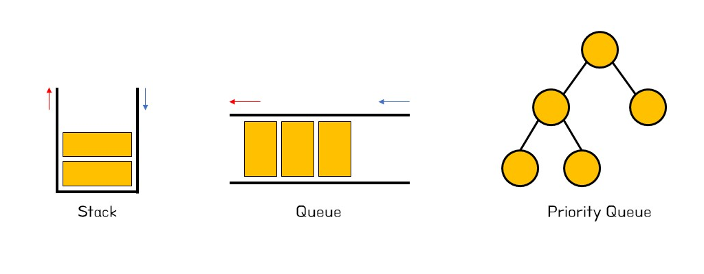

&nbsp;

## :pencil2: 풀이 과정

여기에서는 우선순위 큐의 원리를 설명하였습니다.

먼저 우선순위 큐의 기능은 크게 삽입(enqueue), 삭제(dequeue) 2가지로 나뉩니다.

삽입(enqueue)은 넣고자 하는 원소 값의 우선순위 여부와 관계없이 가장 맨 끝에 삽입한 뒤 상위 노드와 값을 비교하여 우선순위를 업데이트합니다.

삭제(dequeue)는 루트 노드의 값을 리턴하고 가장 맨 끝에 있는 원소를 루트 노드로 옮긴 뒤 하위 노드와 값을 비교하여 우선순위를 업데이트합니다.

&nbsp;

### 삽입 연산

아래 5개의 숫자들을 순차적으로 우선순위 큐에 삽입하고, 숫자가 높을수록 우선순위가 높다고 가정합니다.

```
2, 5, 1, 3, 6
```

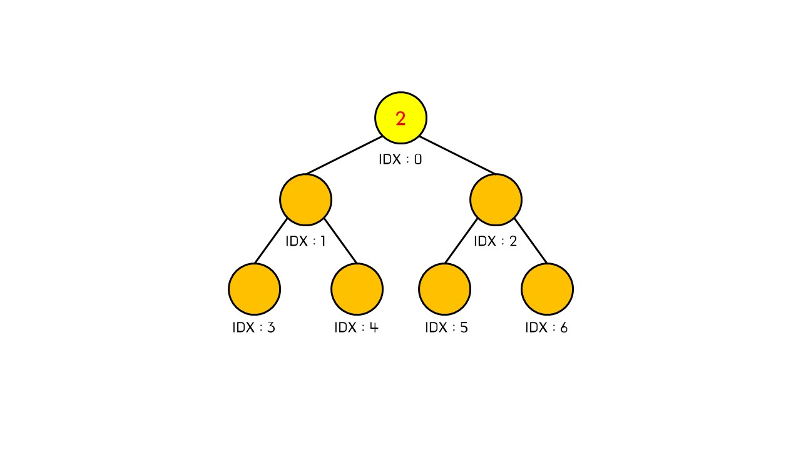

초기에 우선순위 큐가 비어있으므로 삽입한 값 그대로 우선순위 큐 공간에 넣게 됩니다.

&nbsp;

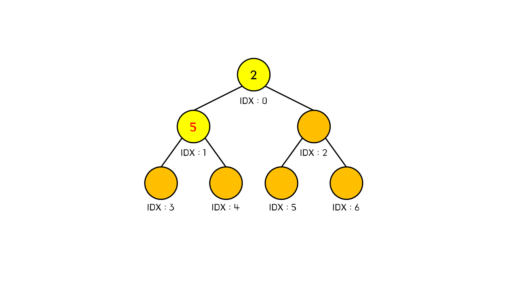

이 상태에서 또 다른 값을 삽입하게 되면 해당 값은 현재 우선순위 큐에서 형성된 이진 트리의 가장 마지막 부분에 삽입하게 됩니다.

즉 해당 값이 크던 작던 상관없이 일단 맨 마지막에 넣고 보자는 것입니다. 여기에서는 5를 삽입했을 때의 초기 결과입니다.

&nbsp;

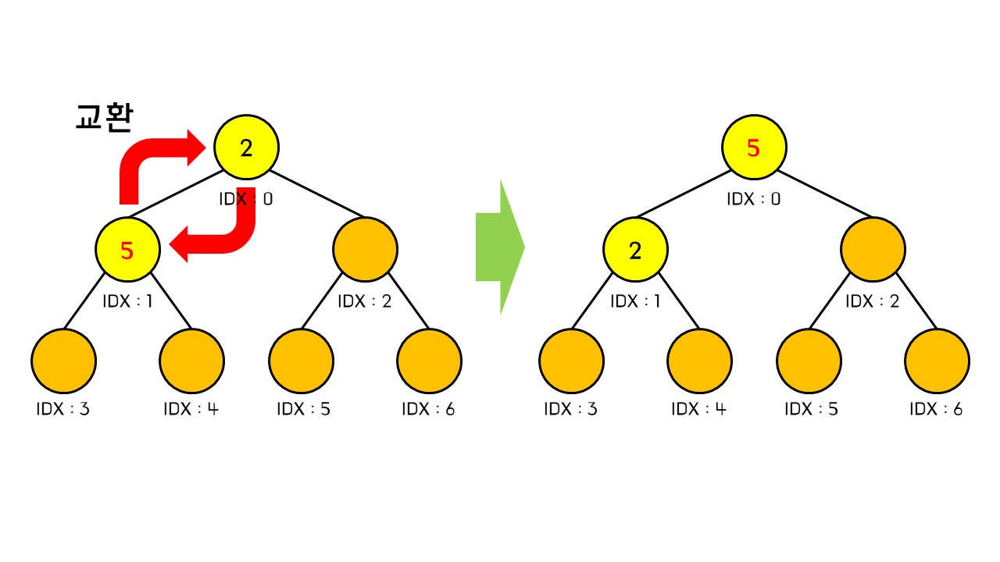

그리고 삽입한 값의 노드를 기준으로 상위 노드와 우선순위 비교를 해야 합니다.

만약 상위 노드보다 우선순위가 높을 경우 상위 노드와 값을 교환하고 그렇지 않다면 그대로 두고 종료합니다. 여기서는 현재 노드인 5가 상위 노드인 2보다 우선순위가 높기 때문에 값을 교환합니다.

값을 교환하고 난 이후 다음 상위노드가 존재한다면 위 과정을 반복해줍니다. 현재 노드 5는 루트 노드이므로 그대로 두고 종료합니다.

&nbsp;

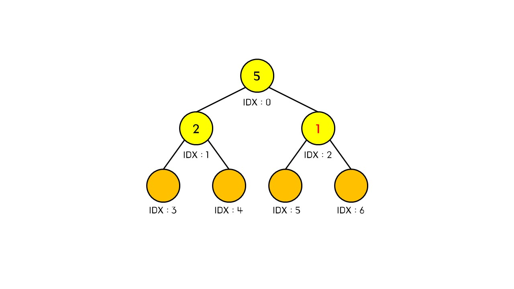

이 상태에서 1을 넣게 되었을 떄 맨 마지막에 값을 넣어주고 상위 노드와 비교합니다.

여기서는 현재 노드값 1이 상위 노드값 5보다 작기 때문에 현재 상태 그대로 두고 종료하게 됩니다.

&nbsp;

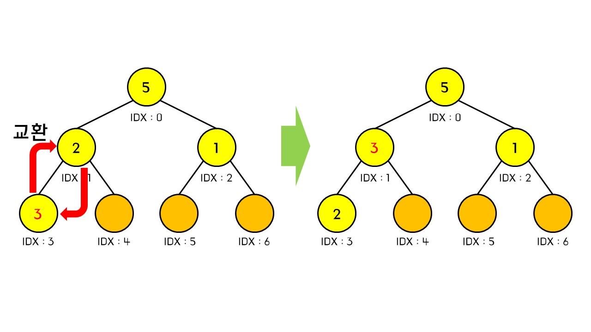

3을 삽입했을 때 과정입니다. 상위 노드(값 : 2) 보다 우선순위가 크므로 값을 교환하고, 그 다음 상위 노드(값 : 5)보다 작으므로 여기에서 종료합니다.

&nbsp;

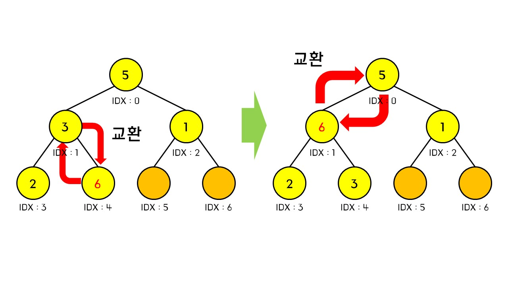

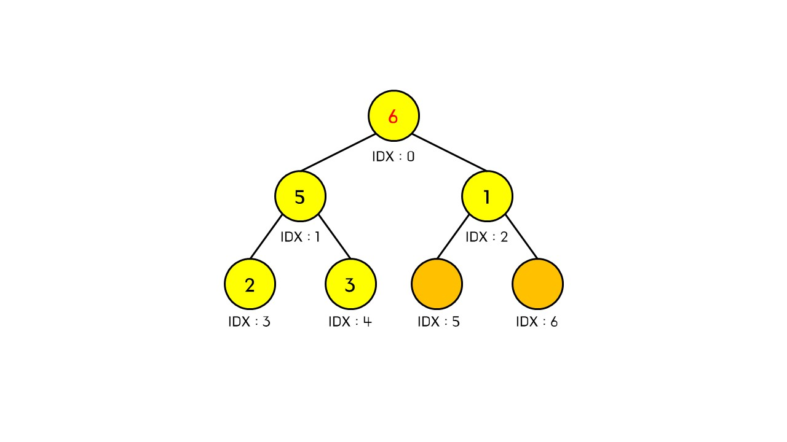

마지막으로 6을 삽입했을 경우 상위 노드(값 : 3)보다 우선순위가 크므로 값을 교환하고, 그 다음 상위 노드(값 : 5)보다 크므로 값을 교환합니다. 이후 다음 상위 노드가 없으므로 6이 가장 우선순위가 높은 노드가 됩니다.

&nbsp;

### 삭제 연산

이번엔 우선순위 큐에 삽입했던 값들을 다시 꺼내는 과정을 살펴보겠습니다.

&nbsp;

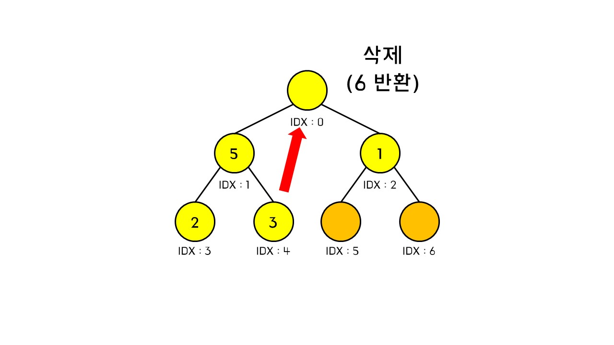

삭제 연산을 수행할 경우 루트 노드에 있는 값을 반환시키고 그 공간에 가장 마지막 원소의 값을 넣어줍니다. 그리고 해당 값을 기준으로 두 하위 노드와 우선순위를 비교해야 합니다.

먼저 하위 노드 중에서 가장 우선순위가 높은 값을 먼저 고른 뒤 현재 노드 값과 비교했을 때 자신의 우선순위가 낮다면 해당 하위 노드와 값을 교환하고 그렇지 않다면 종료합니다.

교환한 이후 자신이 리프 노드(하위 노드가 없는 상태)가 되거나 자신보다 우선순위가 높은 하위 노드가 없을 때까지 위 과정을 반복해줍니다.

&nbsp;

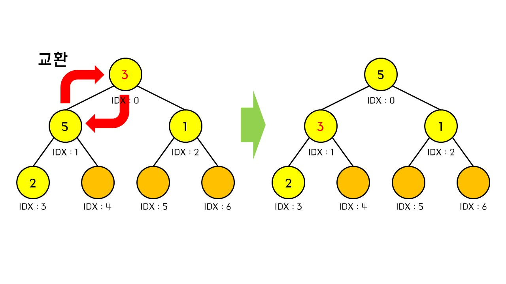

현재 노드(값 : 3)은 가장 우선순위 높은 하위 노드(값 : 5) 보다 우선순위가 낮으므로 값을 교환해줍니다.

그 후 다시 하위 노드와 우선순위를 비교하는데 현재 노드(값 : 3)이 우선순위 높은 하위 노드(값 : 2)보다 우선순위가 낮지 않으므로 그대로 종료합니다.


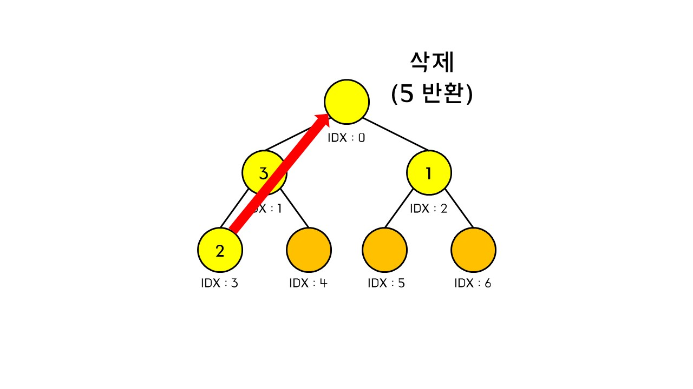

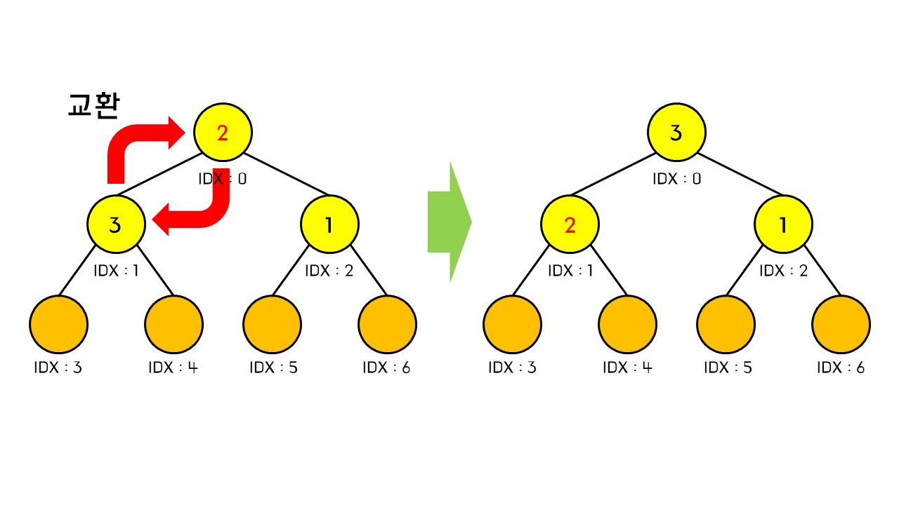

그리고 다시 삭제 연산을 수행했을 경우 루트 노드 값 5를 반환하고 가장 마지막 원소인 2를 루트 노드에 넣어주고 두 하위 노드와 비교합니다.

하위 노드(값 : 3)보다 우선순위가 낮기 때문에 교환해주게 되고, 교환 이후 현재 노드(값 : 2)의 하위 노드가 하나도 없으므로 종료하게 됩니다.

&nbsp;

우선순위 큐 삽입, 삭제 과정을 종합적으로 표현하자면 아래 애니메이션과 같습니다.

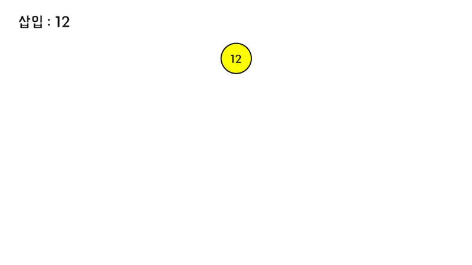

&nbsp;

## :memo: 소스 코드

우선순위 큐를 구현하기 위해서는 이진 트리로 표현할 수 있는 것이 필요합니다.

배열을 이용하여 이진 트리를 표현할 수 있고 연산을 빠르게 처리할 수 있기 때문에 이 글에서는 배열을 이용하여 우선순위 큐를 구현하였습니다.

&nbsp;

### 초기화
우선순위 큐의 기본 구성입니다.

```java
private int[] list;
private int listSize;

public UserPQ(){
    list = new int[100001];
    listSize = 0;
}

```
- 배열 공간은 필요한 만큼 초기화하시면 됩니다.
- 우선순위 큐에 남은 원소 수를 확인하기 위해 별도의 변수를 선언해주고 초기값은 0으로 설정해주어야 합니다.

&nbsp;

### 삽입
주어진 값을 우선순위 큐에 삽입하고 우선순위 큐 내에서 값들의 우선순위를 업데이트합니다.

```java
public void enqueue(int value){
    int curIdx = listSize;
    int nextIdx;

    list[curIdx] = value;
    listSize++;
    while(curIdx != 0){
        nextIdx = (curIdx + 1) / 2 - 1;

        if(list[curIdx] > list[nextIdx]){
            int temp = list[nextIdx];
            list[nextIdx] = list[curIdx];
            list[curIdx] = temp;
        }
        else
            break;

        curIdx = nextIdx;
    }
}

```

&nbsp;

### 삭제
우선순위가 가장 높은 값을 리턴하고 우선순위 큐 내에서 값들의 우선순위를 업데이트합니다.

```java
public int dequeue(){
    int curIdx = 0;
    int rootValue = list[0];
    int tempValue = list[listSize - 1];
    listSize--;

    if(listSize > 0)
        list[curIdx] = tempValue;

    int nextIdx, tempIdxA, tempIdxB;
    while(curIdx < listSize - 1){
        tempIdxA = curIdx * 2 + 1;
        tempIdxB = curIdx * 2 + 2;

        if(tempIdxA < listSize && tempIdxB < listSize){
            if(list[tempIdxA] > list[tempIdxB])
                nextIdx = tempIdxA;
            else
                nextIdx = tempIdxB;
        }
        else if(tempIdxA < listSize)
            nextIdx = tempIdxA;

        else if(tempIdxB < listSize)
            nextIdx = tempIdxB;

        else
            break;

        if(list[curIdx] < list[nextIdx]){
            int temp = list[nextIdx];
            list[nextIdx] = list[curIdx];
            list[curIdx] = temp;
        }

        curIdx = nextIdx;
    }

    return rootValue;
}

```

&nbsp;

### 전체 소스코드
```java
class UserPQ{

    private int[] list;
    private int listSize;

    public UserPQ(){
        list = new int[100001];
        listSize = 0;
    }

    public void enqueue(int value){
        int curIdx = listSize;
        int nextIdx;

        list[curIdx] = value;
        listSize++;
        while(curIdx != 0){
            nextIdx = (curIdx + 1) / 2 - 1;

            if(list[curIdx] > list[nextIdx]){
                int temp = list[nextIdx];
                list[nextIdx] = list[curIdx];
                list[curIdx] = temp;
            }
            else
                break;

            curIdx = nextIdx;
        }
    }

    public int dequeue(){
        int curIdx = 0;
        int rootValue = list[0];
        int tempValue = list[listSize - 1];
        listSize--;

        if(listSize > 0)
            list[curIdx] = tempValue;

        int nextIdx, tempIdxA, tempIdxB;
        while(curIdx < listSize - 1){
            tempIdxA = curIdx * 2 + 1;
            tempIdxB = curIdx * 2 + 2;

            if(tempIdxA < listSize && tempIdxB < listSize){
                if(list[tempIdxA] > list[tempIdxB])
                    nextIdx = tempIdxA;
                else
                    nextIdx = tempIdxB;
            }
            else if(tempIdxA < listSize)
                nextIdx = tempIdxA;

            else if(tempIdxB < listSize)
                nextIdx = tempIdxB;

            else
                break;

            if(list[curIdx] < list[nextIdx]){
                int temp = list[nextIdx];
                list[nextIdx] = list[curIdx];
                list[curIdx] = temp;
            }

            curIdx = nextIdx;
        }

        return rootValue;
    }
}

```

&nbsp;

### 시간복잡도
 - 삽입 :
 - 삭제 :


&nbsp;

## :dart: 추천 문제

(티어 기준은 2022-10-29 입니다. (beta))


<details>
  <summary>[기초] <a href="https://www.acmicpc.net/problem/2075">N번째 큰 수</a> (Silver Ⅱ)</summary>
  <p> - 우선순위 큐의 기본 개념을 알고 있으면 해결할 수 있는 문제입니다.</p>
</details>

<details>
  <summary>[기초] <a href="https://www.acmicpc.net/problem/1715">카드 정렬하기</a> (Gold Ⅳ)</summary>
  <p> - 숫자 카드 묶음이 하나밖에 주어지지 않을 경우 계산 실수에 주의해야 합니다.</p>
</details>

 <details>
   <summary>[활용] <a href="https://www.acmicpc.net/problem/2109">순회강연</a> (Gold Ⅲ)</summary>
   <p> - 값을 먼저 정렬한 다음 하나씩 우선순위 큐에 값을 넣으면서 우선순위가 낮은 값을 제거해야 하는 문제입니다.</p>
 </details>

<details>
  <summary>[활용] <a href="https://www.acmicpc.net/problem/13904">과제</a> (Gold Ⅲ)</summary>
  <p> - 위 문제(2190번: 순회강연)를 우선순위 큐로 풀었다면 이 문제도 금방 풀릴 것입니다.</p>
</details>

<details>
  <summary>[활용] <a href="https://www.acmicpc.net/problem/1150">백업</a> (Diamond Ⅳ)</summary>
  <p> - 주어진 케이블을 가지고 연결되지 않은 두 회사를 연결할 때 나올 수 있는 케이블의 가장 짧은 길이를 구해야 하는 상당히 어려운 그리디 문제입니다.</p>
</details>

&nbsp;

## :clipboard: 출처
- [위키백과 :: 우선순위 큐](https://ko.wikipedia.org/wiki/%EC%9A%B0%EC%84%A0%EC%88%9C%EC%9C%84_%ED%81%90)
