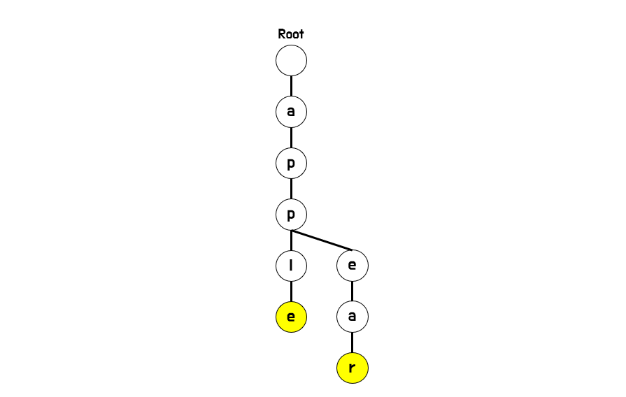

# 트라이(Trie)

## :mortar_board: 개념

트라이(Trie)는 문자열을 트리 형태로 구성한 자료 구조입니다.


&nbsp;

## :zap: 필요성

어떤 정보를 찾기 위해 우리가 웹 브라우저에서 일상적으로 사용하는 것이 검색창입니다.

그리고 검색창에서는 사용자가 원하는 검색어를 좀 더 쉽게 찾을 수 있도록 예상 검색어 기능을 제공합니다.

따라서 일부 키워드만 입력하여도 해당 검색어로 시작되는 예상 검색어들을 빠르게 목록에서 표시해줍니다. 네이버, 구글 등 국내에서 자주 사용하는 검색 포탈이나 도서 검색, 사전 검색에서 흔히 볼 수 있는 기능입니다.


그렇다면 예상 검색어들을 빠르게 가져오기 위해서는 어떤 방법이 있는지 살펴볼 필요가 있습니다.

만약 예상 검색어들을 일반적인 배열이나 리스트에 저장한다고 가정해봅시다. 예상 검색어가 별로 없다면 빠르게 보여줄 수 있겠지만 저장된 예상 검색어가 많아질수록 시간이 점점 오래 걸릴 것입니다. 왜냐하면 주어진 검색어와 부분 일치하는 예상 검색어들을 찾기 위해서 리스트에 저장된 문자열들을 모두 확인해야 하기 때문입니다.

그러나 해당 기능을 트라이(Trie) 자료구조를 활용하여 구현한다면 좀 더 효율적인 예상 검색어 기능을 제공할 수 있게 됩니다. 모든 리스트의 문자열을 확인할 필요 없이 입력한 키워드와 연결된 키워드들만 확인하면 되기 때문입니다.


&nbsp;

## :pencil2: 풀이 과정

다음과 같은 예상 검색어가 주어졌다고 가정합시다.
```
apple			backward
banana			pin
pine			pinetown
appear			applied
```

주어진 예상 검색어를 가지고 아래와 같이 트라이를 구성합니다.


초기에는 부모 트라이 하나만 존재할 것이며, 트라이에 기본적으로 트라이 배열이 초기화되어 있습니다. 이는 소문자 a~z까지 담기 위한 용도입니다.

이제 여기서 "apple" 이라는 검색어를 저장하기 위해 트라이를 구성해봅시다.
삽입 순서는 주어진 첫번쨰 문자부터 마지막 문자까지 순서대로 진행합니다.


첫번째 문자인 a가 주어지는데 현재 트라이에서 a에 해당하는 배열 인덱스에 객체가 없기 때문에 해당 배열 인덱스에 트라이 객체를 생성하게 됩니다. (여기서 객체 생성은 문자를 삽입하는 것과 같습니다.)

그리고 방금 생성했던 트라이를 호출하여 다음 문자를 확인하여 이같은 과정을 반복합니다.
마지막 문자까지 도달했을 떄 (필요할 경우)별도의 멤버변수를 이용하여 자기 자신이 특정 키워드의 마지막 문자임을 표시해둡니다. "apple"을 삽입했을 때 결과는 아래와 같습니다.


그리고 이 상태에서 "appear" 검색어를 추가로 삽입할 경우의 과정은 다음과 같습니다.




```
첫번째 문자 a가 이미 있으므로 다음 문자로 넘어갑니다.
두번째 문자 p도 이미 있으므로 다음 문자로 넘어갑니다.
세번째 문자 p도 이미 있으므로 다음 문자로 넘어갑니다.
네번째 문자 e는 없으므로 삽입 후 다음 문자로 넘어갑니다.
다섯째 문자 a는 없으므로 삽입 후 다음 문자로 넘어갑니다.
여섯째 문자 r는 없으므로 삽입 후 다음 문자로 넘어갑니다.
일곱째 문자는 없으므로 마지막 문자 r에 대해 마지막 문자임을 명시하고 종료합니다.
```


&nbsp;

## :memo: 소스 코드

트라이를 구현하는 방법은 여러 방법이 있을 수 있으나 여기에서는 객체를 이용하여 트라이를 구현하였습니다.


&nbsp;

### 초기화
트라이를 생성하는 코드입니다.

```java
private int cnt;            // 현재 문자 갯수 (삭제 연산 사용시)
private boolean isLastStr;  // 특정 키워드의 마지막 문자 여부
private Trie[] next;        // 다음 문자를 나타냄. (a ~ z)


public Trie(){
    this.cnt = 0;
    this.isLastStr = false;
    this.next = new Trie[26];
}

```
- 트라이는 다음 문자(객체)를 확인하기 위한 트라이 배열이 기본적으로 선언되어야 합니다.
- 나머지 cnt(현재 문자 갯수)나 isLastStr(마지막 문자 여부)는 필요에 따라 사용하시면 됩니다.
- 이 소스코드에서 트라이의 배열은 소문자 a~z를 표현하였으며 (총 26개), 상황에 따라 적절히 수정하시면 됩니다.

&nbsp;

### 삽입
주어진 문자열을 트라이에 삽입합니다.

```java
public void add(int idx, char[] text){
    // 문자열 끝에 도달했을 경우
    if(idx == text.length){
        isLastStr = true;
        return;
    }

    int nextIdx = text[idx] - 97;
    if(next[nextIdx] == null)
        next[nextIdx] = new Trie();

    // 문자 갯수 올리고 다음 문자 확인
    next[nextIdx].addCnt(1);
    next[nextIdx].add(idx + 1, text);
}

```
- 초기 호출시 인덱스는 0부터 시작합니다. (예시 : trie.add(0, "text"); )


&nbsp;

### 삭제
주어진 문자열을 트라이에서 삭제합니다.

```java
public boolean remove(int idx, char[] text){
    // 문자열 끝에 도달했을 경우
    if(idx == text.length){
        if(isLastStr){
            isLastStr = false;
            return true;
        }

        return false;
    }

    int nextIdx = text[idx] - 97;
    if(next[nextIdx] == null)
        return false;

    if(next[nextIdx].getCnt() > 0 && next[nextIdx].remove(idx + 1, text)){
        next[nextIdx].addCnt(-1);

        // 문자 삭제 이후 해당 문자의 카운트가 0이면 객체 삭제
        if(next[nextIdx].getCnt() == 0)
            next[nextIdx] = null;

        return true;
    }

    return false;
}

```
- 초기 호출시 인덱스는 0부터 시작합니다. (예시 : trie.remove(0, "text"); )
- 입력한 문자열과 동일한 문자열이 존재할 경우 해당 문자열이 삭제되면서 true를 반환되고, 아닐 경우 false를 반환합니다.


&nbsp;

### 탐색
주어진 문자열이 존재하는지 검색합니다.

```java
public boolean search(int idx, char[] text){
    // 문자열 끝에 도달했을 경우
    if(idx == text.length && isLastStr)
        return true;

    int nextIdx = text[idx] - 97;

    // 다음 문자가 없을 경우 탐색 실패
    if(next[nextIdx] == null)
        return false;

    // 다음 문자 확인
    return next[nextIdx].search(idx + 1, text);
}

```
- 초기 호출시 인덱스는 0부터 시작합니다. (예시 : trie.search(0, "text"); )
- 입력한 문자열과 동일한 문자열이 존재할 경우 true, 아닐 경우 false를 반환합니다.


&nbsp;

### 전체 소스코드
```java
class Trie{

    private int cnt;
    private boolean isLastStr;
    private Trie[] next;

    public Trie(){
        this.cnt = 0;
        this.isLastStr = false;
        this.next = new Trie[26];
    }

    public void add(int idx, char[] text){

        if(idx == text.length){
            isLastStr = true;
            return;
        }

        int nextIdx = text[idx] - 97;
        if(next[nextIdx] == null)
            next[nextIdx] = new Trie();

        next[nextIdx].addCnt(1);
        next[nextIdx].add(idx + 1, text);
    }

    public boolean remove(int idx, char[] text){

        if(idx == text.length){
            if(isLastStr){
                isLastStr = false;
                return true;
            }

            return false;
        }


        int nextIdx = text[idx] - 97;
        if(next[nextIdx] == null)
            return false;

        if(next[nextIdx].getCnt() > 0 && next[nextIdx].remove(idx + 1, text)){
            next[nextIdx].addCnt(-1);

            if(next[nextIdx].getCnt() == 0)
                next[nextIdx] = null;

            return true;
        }

        return false;
    }

    public boolean search(int idx, char[] text){

        if(idx == text.length && isLastStr)
            return true;

        int nextIdx = text[idx] - 97;

        if(next[nextIdx] == null)
            return false;

        return next[nextIdx].search(idx + 1, text);
    }

    public int getCnt(){ return cnt; }
    public void addCnt(int plus){ cnt = cnt + plus; }
}

```

### 시간복잡도
주어진 문자의 크기가 n일 경우
 - 삽입 : O(n)
 - 삭제 : O(n)
 - 탐색 : O(n)


&nbsp;

## :dart: 추천 문제

(티어 기준은 2022-09-16 입니다.)


[입문] [접두사 찾기](https://www.acmicpc.net/problem/14426) (Silver Ⅱ)

[기초] [개미굴](https://www.acmicpc.net/problem/14725) (Gold Ⅲ)

[기초] [휴대폰 자판](https://www.acmicpc.net/problem/5670) (Platinum Ⅳ)

[활용] [용량 부족](https://www.acmicpc.net/problem/5446) (Platinum Ⅲ)

[활용] [수열과 쿼리 20](https://www.acmicpc.net/problem/16903) (Platinum Ⅲ)

[활용] [두 수 XOR](https://www.acmicpc.net/problem/13505) (Platinum Ⅲ)

[활용] [전설](https://www.acmicpc.net/problem/19585) (Platinum Ⅲ)


&nbsp;

## :clipboard: 출처
- [위키백과 :: 트라이(컴퓨팅)](https://ko.wikipedia.org/wiki/%ED%8A%B8%EB%9D%BC%EC%9D%B4_(%EC%BB%B4%ED%93%A8%ED%8C%85)#cite_note-6)
