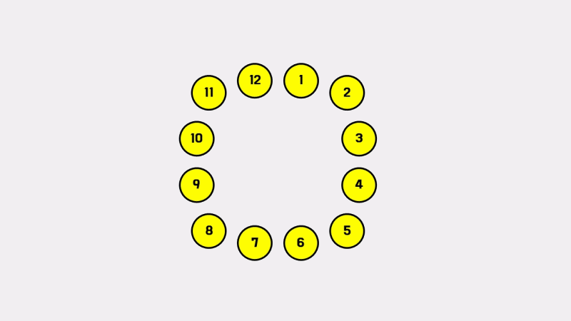

# 요세푸스 문제 (1158번, JAVA)
- 문제 링크 : https://www.acmicpc.net/problem/1158

## :mag: 문제 보기

사람들끼리 원을 이루어 앉아있다고 가정했을 때 몇 번째마다 사람을 한 명씩 제거하고 이 과정을 마지막 한 사람이 제거될 때까지 반복합니다.

그리고 제거된 사람 순으로 결과를 출력해야 하는 문제입니다.


&nbsp;

## :bulb: 문제 이해

12명의 사람들끼리 원을 이루어 앉아있다고 가정합니다. (각 사람에게 1번부터 12번까지 순서대로 번호가 주어졌다고 가정합니다.)

그리고 5번째마다 사람을 한명씩 제거할 경우 처음에 5번째에 앉았던 사람이 제거되고 그 다음은 10번째에 앉았던 사람이 제거됩니다.

그렇게 한 사람씩 제거하면서 마지막 남은 사람까지 제거하고 먼저 제거된 사람부터 출력하면 다음과 같습니다.
```
<5, 10, 3, 9, 4, 12, 8, 7, 11, 2, 6, 1>
```

&nbsp;

계산 과정의 이해를 돕기 위해 위 과정들을 그림으로 표현하면 다음과 같습니다.




&nbsp;

원형으로 돌면서 몇 번째마다 사람을 한 명씩 제거해나간다는 점과, 주어지는 N명의 인원 및 K번째 수가 최대 5,000 이므로 N, K 최대 연산을 수행하여도 25,000,000 회 연산(자바 기준 0.25초)이 주어진 시간 내에 충분히 연산 가능하고 메모리도 넉넉하게 주어지기 때문에 선입선출(FIFO) 방식인 큐(Queue)를 이용하여 풀 수 있습니다.

하지만 꼭 큐를 사용하지 않고도 문제를 해결할 수 있습니다. 이 내용에서는 큐가 아닌 ArrayList를 활용한 단순 구현 방식으로 문제를 풀었으며, 이 방법은 큐를 사용하는 것보다 더 빠르게 연산을 수행합니다. (BFS와 같이 큐를 활용해야 하는 문제라도 최적화가 필요할 경우 큐 대신 배열리스트를 써야 할 때도 있습니다.)


&nbsp;

## :pencil2: 문제 풀이
```
1. 사람 수(N), K번째 값을 가져옵니다.

2. ArrayList 객체를 생성합니다. (Integer 형)

3. 사람 수(N)명 만큼 ArrayList 객체에 0번부터 N-1번까지 순서대로 추가합니다.

4. 반복문을 수행하기 전 target 변수를 하나 선언 및 초기화합니다. (초기값 : -1)

5. 반복문을 수행합니다. (ArrayList 객체가 비어있을 때까지 반복)
    5-1. target에 K를 더하고 현재 배열 리스트의 크기만큼 나눈 나머지를 구합니다.
         target = (target + K) % 현재 ArrayList 객체 크기

    5-2. 해당 target을 배열 리스트에서 제거하고 제거한 target의 정수값 + 1을 StringBuilder를 이용하여 담아냅니다.

    5-3. 만약 target이 0일 경우 현재 ArrayList 크기로 초기화합니다.

    5-4. target을 1만큼 감소시킵니다.

6. 결과 출력

```

시각적으로 확인하면서 문제를 풀어봅시다.

먼저 ArrayList 객체를 생성하고 0 ~ N-1까지 담습니다.

<table>
  <th>Index</th><th>0</th><th>1</th><th>2</th><th>3</th><th>4</th><th>5</th><th>6</th><th>7</th><th>8</th><th>9</th><th>10</th><th>11</th>
  <tr><td>Value</td><td>0</td><td>1</td><td>2</td><td>3</td><td>4</td><td>5</td><td>6</td><td>7</td><td>8</td><td>9</td><td>10</td><td>11</td>
  </tr>
</table>

target을 -1로 초기화하고 반복문을 수행하여 ArrayList가 비어있을 때까지 계산할 경우 다음과 같습니다.

&nbsp;

target = (target + k) % size = (-1 + 5) % 12 = 4

4번째 인덱스 삭제 후 해당 인덱스의 값(4) + 1을 출력 (<5>)   ... target 값 감소 ( 4 -> 3 )

<table>
  <th>Index</th><th>0</th><th>1</th><th>2</th><th>▼</th><th>4</th><th>5</th><th>6</th><th>7</th><th>8</th><th>9</th><th>10</th>
  <tr><td>Value</td><td>0</td><td>1</td><td>2</td><td>3</td><td>5</td><td>6</td><td>7</td><td>8</td><td>9</td><td>10</td><td>11</td>
  </tr>
</table>


&nbsp;

target = (3 + 5) % 11 = 8

8번째 인덱스 삭제 후 해당 인덱스의 값(9) + 1을 출력 (<5, 10>)   ... target 값 감소 ( 8 -> 7 )

<table>
  <th>Index</th><th>0</th><th>1</th><th>2</th><th>3</th><th>4</th><th>5</th><th>6</th><th>▼</th><th>8</th><th>9</th>
  <tr><td>Value</td><td>0</td><td>1</td><td>2</td><td>3</td><td>5</td><td>6</td><td>7</td><td>8</td><td>10</td><td>11</td>
  </tr>
</table>


&nbsp;

target = (7 + 5) % 10 = 2

2번째 인덱스 삭제 후 해당 인덱스의 값(2) + 1을 출력 (<5, 10, 3>)   ... target 값 감소 ( 2 -> 1 )

<table>
  <th>Index</th><th>0</th><th>▼</th><th>2</th><th>3</th><th>4</th><th>5</th><th>6</th><th>7</th><th>8</th>
  <tr><td>Value</td><td>0</td><td>1</td><td>3</td><td>5</td><td>6</td><td>7</td><td>8</td><td>10</td><td>11</td>
  </tr>
</table>


&nbsp;

target = (1 + 5) % 9 = 6

6번째 인덱스 삭제 후 해당 인덱스의 값(8) + 1을 출력 (<5, 10, 3, 9>)   ... target 값 감소 ( 6 -> 5 )

<table>
  <th>Index</th><th>0</th><th>1</th><th>2</th><th>3</th><th>4</th><th>▼</th><th>6</th><th>7</th>
  <tr><td>Value</td><td>0</td><td>1</td><td>3</td><td>5</td><td>6</td><td>7</td><td>10</td><td>11</td>
  </tr>
</table>


&nbsp;

target = (5 + 5) % 8 = 2

2번째 인덱스 삭제 후 해당 인덱스의 값(3) + 1을 출력 (<5, 10, 3, 9, 4>)   ... target 값 감소 ( 2 -> 1 )

<table>
  <th>Index</th><th>0</th><th>▼</th><th>2</th><th>3</th><th>4</th><th>5</th><th>6</th>
  <tr><td>Value</td><td>0</td><td>1</td><td>5</td><td>6</td><td>7</td><td>10</td><td>11</td>
  </tr>
</table>


&nbsp;

target = (1 + 5) % 7 = 6

6번째 인덱스 삭제 후 해당 인덱스의 값(11) + 1을 출력 (<5, 10, 3, 9, 4, 12>)   ... target 값 감소 ( 6 -> 5 )

<table>
  <th>Index</th><th>0</th><th>1</th><th>2</th><th>3</th><th>4</th><th>▼</th>
  <tr><td>Value</td><td>0</td><td>1</td><td>5</td><td>6</td><td>7</td><td>10</td>
  </tr>
</table>


&nbsp;

target = (5 + 5) % 6 = 4

4번째 인덱스 삭제 후 해당 인덱스의 값(7) + 1을 출력 (<5, 10, 3, 9, 4, 12, 8>)   ... target 값 감소 ( 4 -> 3 )

<table>
  <th>Index</th><th>0</th><th>1</th><th>2</th><th>▼</th><th>4</th>
  <tr><td>Value</td><td>0</td><td>1</td><td>5</td><td>6</td><td>10</td>
  </tr>
</table>


&nbsp;

target = (3 + 5) % 5 = 3

3번째 인덱스 삭제 후 해당 인덱스의 값(6) + 1을 출력 (<5, 10, 3, 9, 4, 12, 8, 7>)   ... target 값 감소 ( 3 -> 2 )

<table>
  <th>Index</th><th>0</th><th>1</th><th>▼</th><th>3</th>
  <tr><td>Value</td><td>0</td><td>1</td><td>5</td><td>10</td>
  </tr>
</table>


&nbsp;

target = (2 + 5) % 4 = 3

3번째 인덱스 삭제 후 해당 인덱스의 값(10) + 1을 출력 (<5, 10, 3, 9, 4, 12, 8, 7, 11>)   ... target 값 감소 ( 3 -> 2 )

<table>
  <th>Index</th><th>0</th><th>1</th><th>▼</th>
  <tr><td>Value</td><td>0</td><td>1</td><td>5</td>
  </tr>
</table>


&nbsp;

target = (2 + 5) % 3 = 1

1번째 인덱스 삭제 후 해당 인덱스의 값(1) + 1을 출력 (<5, 10, 3, 9, 4, 12, 8, 7, 11, 2>)   ... target 값 감소 ( 1 -> 0 )

<table>
  <th>Index</th><th>▼</th><th>1</th>
  <tr><td>Value</td><td>0</td><td>5</td>
  </tr>
</table>


&nbsp;

target = (0 + 5) % 2 = 1

1번째 인덱스 삭제 후 해당 인덱스의 값(5) + 1을 출력 (<5, 10, 3, 9, 4, 12, 8, 7, 11, 2, 6>)   ... target 값 감소 ( 1 -> 0 )

<table>
  <th>Index</th><th>▼</th>
  <tr><td>Value</td><td>0</td>
  </tr>
</table>


&nbsp;

target = (0 + 5) % 1 = 0

0번째 인덱스 삭제 후 해당 인덱스의 값(0) + 1을 출력 (<5, 10, 3, 9, 4, 12, 8, 7, 11, 2, 6, 1>)


&nbsp;

## :clipboard: 참고 자료(출처)
 - 없음
