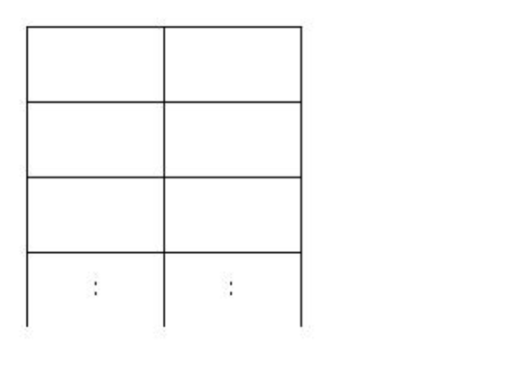
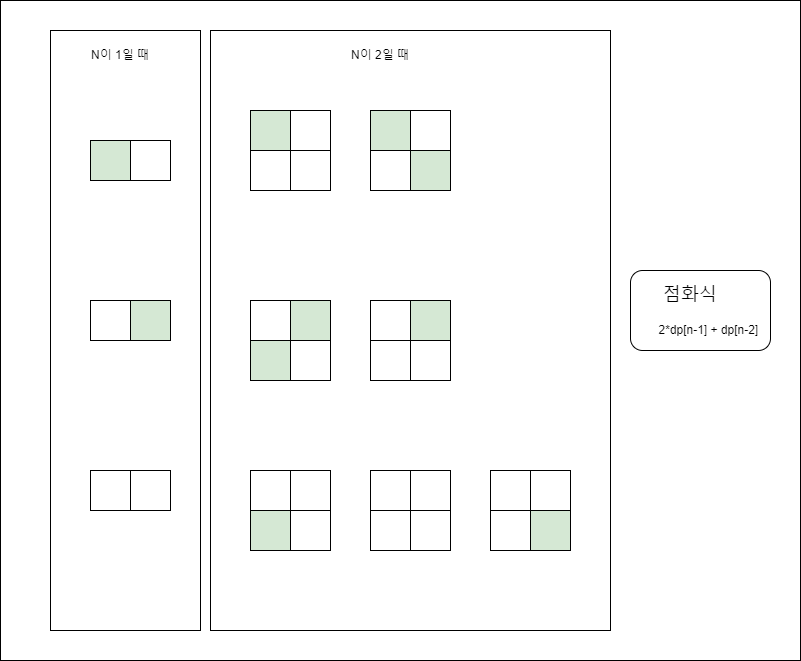

# BOJ_1309_동물원

## 문제보기

어떤 동물원에 사자가 살고있다. 사자의 우리는 아래와같이 2N개의 우리로 이루어져 있다.

사자들은 무척 사나워서 사자가배치된 칸 가로 세로칸에는 다른 사자가 와서는 안된다. n이 주어졌을 때 사자를 배치할 수 있는 경우의 수를 구하여야 한다. 이때 N은 1≤N≤100000으로 주어진다.

## 문제 이해

N이 10만이 주어졌을 때 전체 탐색으로 탐색하게되면 n^2 시간 복잡도가 걸리게 된다. 10만 x 10만 번의 연산은 정해진 시간안에 문제를 해결할 수 없기 때문에 다른 방법을 찾아야 한다.

위와같이 사자 우리는 배열처럼 나열되어 있기 때문에 DP방식으로 해당 문제를 풀 수 있을 것으로 보인다.   

## 문제 풀이

N이 1일 때와 N이 2일 경우의 수를 아래와 같이 그림으로 나타내었다.

아래 그림을 통해 N이 3일 경우를 유추해보자.

사자 우리가 1만큼 커질 때마다 우측에 사자, 좌측에 사자, 사자 없음 경우의 수가 추가된다.

만약에 이전 칸에 사자가 없었을 경우 추가 경우의 수 3, 이전에 사자가 있었을 경우 2칸의 경우의 수가 추가된다.

 n이 2일 때 가장 하단 칸에 

- 사자가 없는 경우 3칸
- 사자가 있는 경우 4칸으로 구성 되어있다.

위 규칙을 생각해보았을 때 n이 3일경우 

- 2* N이 2일 때 + N이 1일 때

의 식이 나타난다.

위 식을 점화식으로 정리하면 

- 2*dp[n-1] + dp[n-2]

으로 구할 수 있다.

