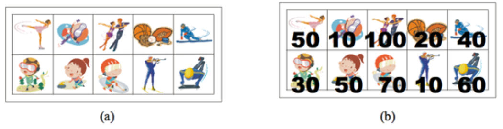
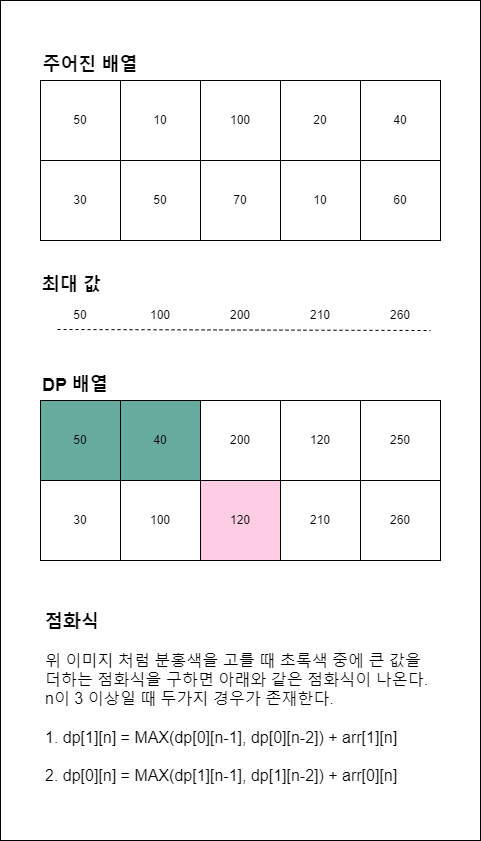

# BOJ_9465_스티커

• `문제 보기` : 해당 문제 설명을 간략히 표현 (문제 내용을 그대로 가져오면 안됩니다.)

위와같이 가로축을 n으로 했을 때 2n개의 스티커가 존재한다. 스티커를 뜯으면 좌우 스티커도 같이 뜯겨나간다고 한다(좌우 스티커는 사용 불능). 이 때 최대한 높은 점수를 얻기 위해서는 어떻게 스티커를 뜯어야 되는지 구해야 한다.

**입력**

n ( 1 ≤ n ≤ 100,000) 이 있을 때 n이 최대일 경우 전체 탐색으로 답을 구할 수 없다. 따라서 DP로 문제를 풀어야 된다.

**출력**

스티커 점수의 최댓값

• `문제 이해` : 스티커 문제를 해결하기 위해서는 우선 n의 범위를 확인하여야 한다. n이 최대 10만개이므로 2의 제곱 시간 복잡도가 날 경우 문제를 해결할 수 없다. 이럴 경우 dp를 생각해 볼 수 있다.

• `문제 풀이` : DP 문제를 해결하기 위해서 점화식을 찾아 내야한다. n번째 스티커의 점수 최대 합을 구하려 할때 좌 우의 스티커는 고려되지 않고, 양변에 영향을 미치므로 가로로 n-1, n-2번째 까지 생각해야 한다. 그리고 행이 윗 행일 경우 아랫행 스티커는 사용할 수 없고 반대도 마찬가지다. 그럴경우 아래와 같은 점화식이 구해진다. 

위 점화식을 이용하여 문제를 해결할 수 있다. 여기서 주의할 부분이 있다. n값이 1일 수 있기 때문에 n-2 값을 고려하는 점화식을 모든 경우의 식에 대입하면 당연히 오류가 난다. 이를 주의해서 문제를 풀어야 한다.